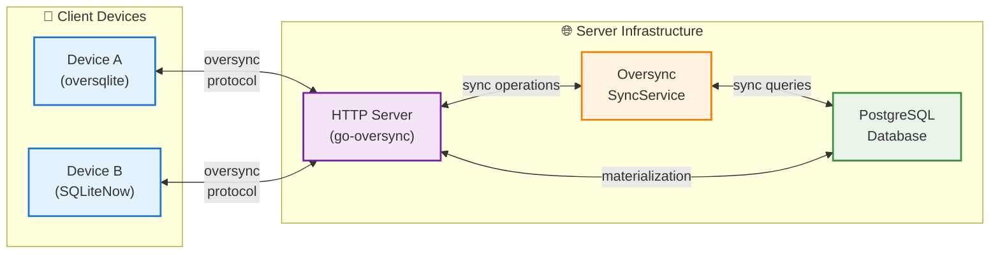

# Multi-Device Synchronization Architecture

go-oversync provides a complete synchronization system for building multi-device applications. The oversync server package enables seamless data sharing across multiple devices with automatic conflict resolution, change tracking, and offline-first capabilities.

## Overview

go-oversync is a server library that synchronizes client databases by providing HTTP endpoints that support the oversync protocol. **SQLiteNow** is a Kotlin Multiplatform project that provides client libraries for data synchronization with SQLite databases, allowing developers to build mobile apps that sync with go-oversync servers.

### Architecture

- **go-oversync Server**: Library that plugs into your HTTP server to provide sync endpoints
- **Oversync Protocol**: Standardized protocol for multi-device synchronization
- **Client Libraries**: SQLite clients (Go oversqlite, Kotlin Multiplatform SQLiteNow)
- **Your HTTP Server**: Built using go-oversync library to handle sync requests
- **PostgreSQL Database**: Server-side storage for the authoritative dataset

This architecture is designed for real-world multi-device applications where users expect their data to be available and consistent across all their devices. Whether it's a note-taking app, task manager, or collaborative tool, go-oversync handles the complex aspects of data synchronization automatically.

### Key Features

- **Automatic Change Tracking** - Tracks all INSERT, UPDATE, DELETE operations on sync-enabled tables
- **Conflict Resolution** - Optimistic concurrency control with automatic conflict detection
- **Offline-First** - Works seamlessly offline, syncs when connection is available
- **Secure Authentication** - Pluggable authentication with any system (JWT, sessions, API keys)
- **Incremental Sync** - Efficient sync with pagination and change-based updates
- **Foreign Key Aware** - Respects database relationships and ordering constraints

## How It Works

go-oversync follows a simple but powerful client-server pattern:

1. **Register tables** you want to synchronize with the oversync service
2. **Add HTTP handlers** to your existing server using go-oversync library
3. **Configure authentication** between your clients and the sync server
4. **Bootstrap client devices** to prepare for sync operations
5. **Sync regularly** to keep data consistent across devices

go-oversync handles all the complex aspects automatically - change tracking, conflict resolution, network failures, and data consistency. Your HTTP server manages the authoritative state and coordinates between all connected devices.

## Architecture Overview

go-oversync follows a client-server architecture using the oversync protocol:

1. **Client Libraries** track local changes and periodically sync with the server
2. **HTTP Server** (built with go-oversync library) maintains the authoritative state in PostgreSQL and resolves conflicts
3. **Changes** are tracked at the row level with timestamps and device attribution
4. **Conflicts** are resolved using optimistic concurrency control when the same data is modified on multiple devices

This architecture ensures data consistency while allowing offline operation and handling network interruptions gracefully. Your HTTP server, built using the go-oversync library, acts as the central coordinator, storing all data in PostgreSQL and managing synchronization between all connected clients.

## Core Concepts

Start here to understand the fundamental concepts of go-oversync's synchronization system.

### [Core Concepts →]({{ site.baseurl }}/documentation/core-concepts/)

Learn about users, devices, hydration, upload/download flows, and other essential sync concepts.
