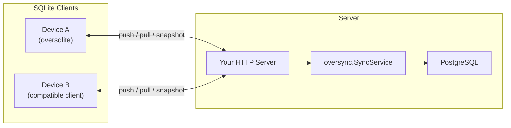

# Multi-Device Synchronization Architecture

go-oversync implements a bundle-based replication model for SQLite clients and PostgreSQL servers.
This page describes the current architecture in this repository, not earlier protocol iterations.

## Overview

The current architecture has four main pieces:

- your application HTTP server
- `oversync.SyncService` on PostgreSQL
- `oversqlite.Client` on SQLite
- the bundle/snapshot HTTP protocol between them

## How It Works

1. Your server registers the PostgreSQL tables that participate in sync.
2. `Bootstrap()` validates the schema and prepares the sync metadata/runtime topology.
3. The SQLite client tracks local writes in `_sync_dirty_rows` with triggers.
4. `PushPending()` freezes those writes into `_sync_push_outbound`, uploads them through
   `/sync/push-sessions`, then replays the authoritative committed bundle returned by the server.
5. `PullToStable()` reads complete committed bundles from `/sync/pull` and advances the local
   checkpoint only after durable local apply.
6. `Hydrate()` and `Recover()` rebuild managed tables from `/sync/snapshot-sessions` when a client
   is new or falls behind retained history. The server materializes those frozen snapshots inside
   PostgreSQL session tables and serves chunk reads statelessly by `snapshot_id`.

```mermaid
flowchart LR
    subgraph Clients["SQLite Clients"]
        DeviceA["Device A<br/>(oversqlite)"]
        DeviceB["Device B<br/>(compatible client)"]
    end

    subgraph Server["Server"]
        HTTPServer["Your HTTP Server"]
        SyncService["oversync.SyncService"]
        PostgreSQL["PostgreSQL"]
    end

    DeviceA <-->|"push / pull / snapshot"| HTTPServer
    DeviceB <-->|"push / pull / snapshot"| HTTPServer
    HTTPServer --> SyncService
    SyncService --> PostgreSQL
```

## Authoritative State

PostgreSQL business tables are authoritative. Sync metadata is derived from committed
business-table effects and stored under the `sync` schema.

Important runtime tables include:

- `sync.user_state`
- `sync.row_state`
- `sync.bundle_log`
- `sync.bundle_rows`
- `sync.applied_pushes`
- `sync.push_sessions`
- `sync.push_session_rows`
- `sync.snapshot_sessions`
- `sync.snapshot_session_rows`

## Server-Originated Writes

If your application writes registered PostgreSQL tables outside client push handling, it should do
so through `WithinSyncBundle(...)`. That ensures the committed business transaction is captured as
one sync bundle visible to other clients.

## Core Concepts

### [Core Concepts →]({{ site.baseurl }}/documentation/core-concepts/)

Read the core concepts page for the exact vocabulary used by the current contract.
