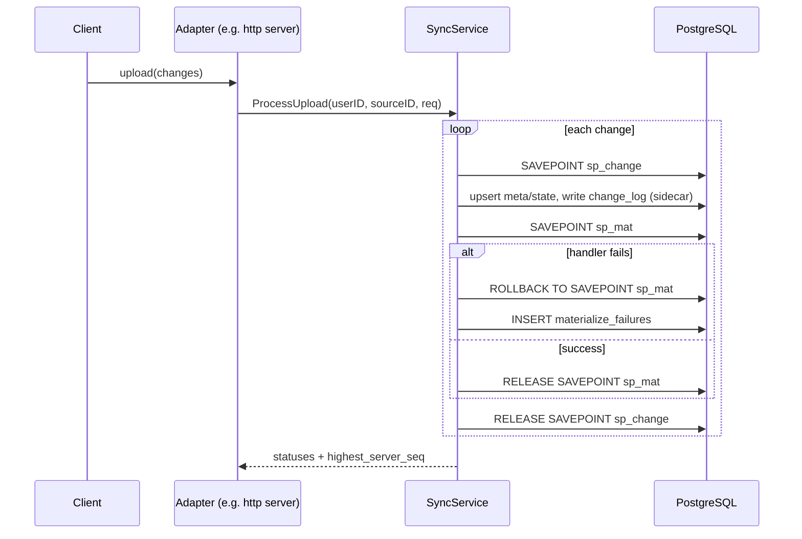
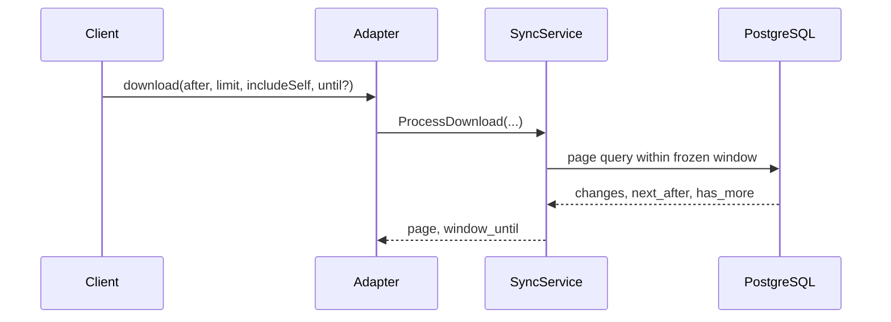
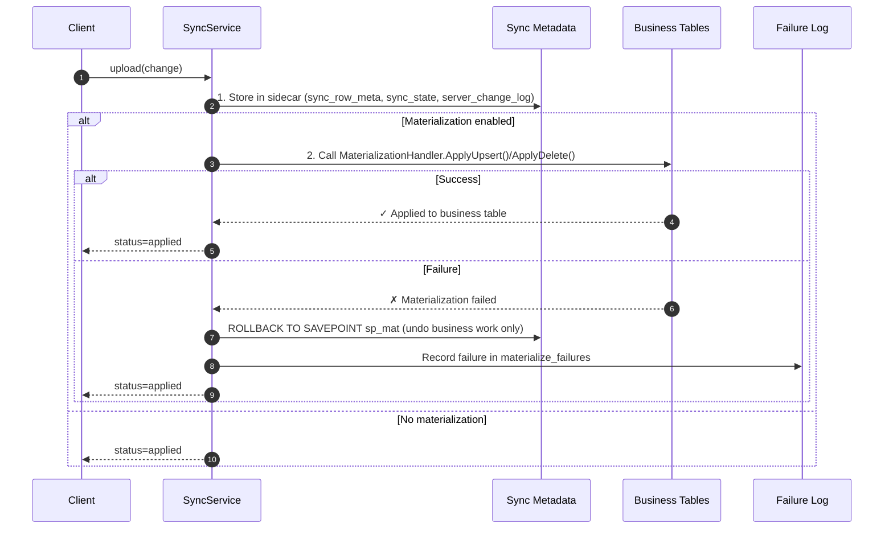
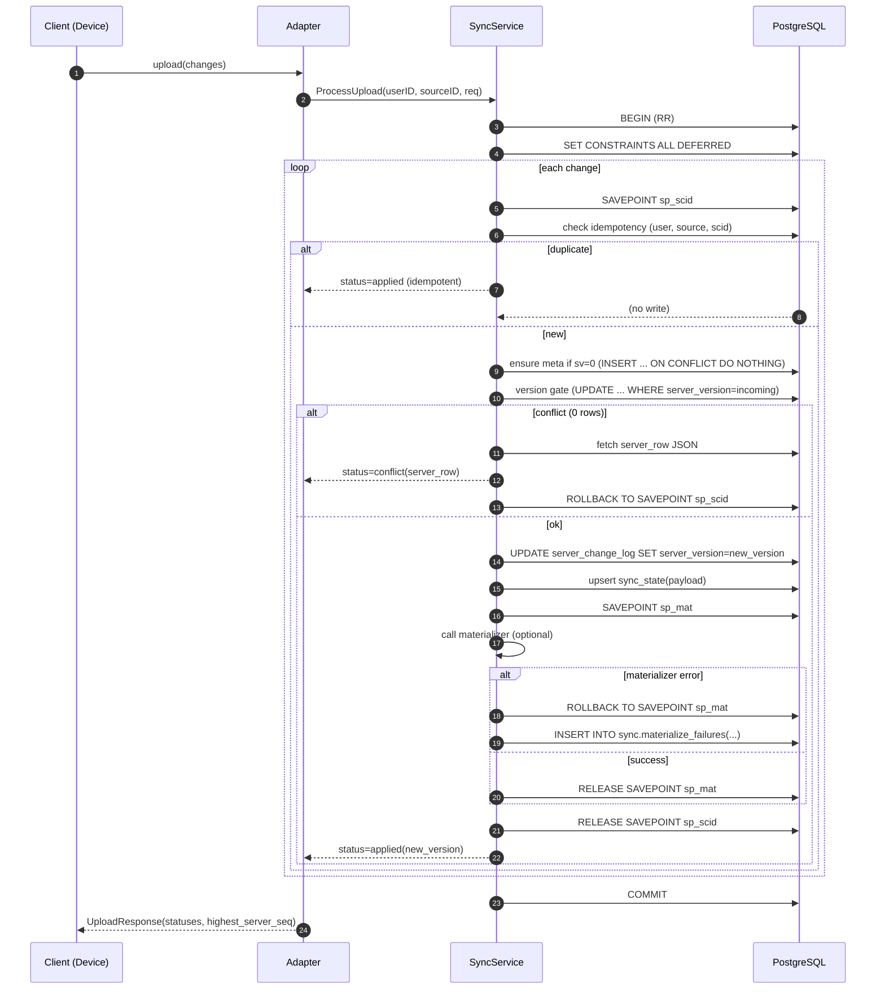
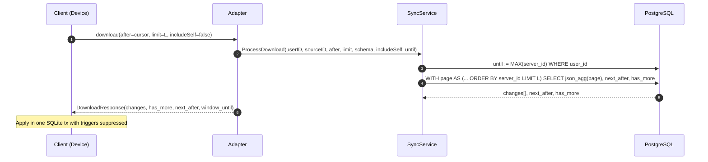
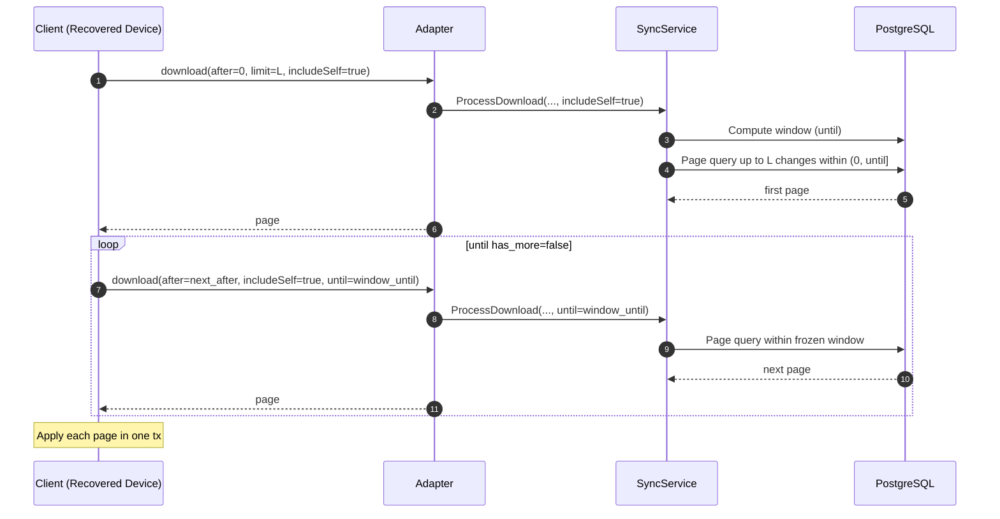

This document explains how the `oversync` server package implements two-way synchronization using a
sidecar schema in PostgreSQL. It focuses on the mechanics, SQL, and the rationale behind the design.

- Model: single-user multi-device
    - Adapter-provided user_id (isolation)
    - Adapter-provided source_id (device attribution)
- Sidecar: dedicated `sync` schema holds all sync metadata; business tables remain clean.
- Multi‑schema aware: every change belongs to `(schema_name, table_name)`.

## Overview

### The Sidecar Architecture

Instead of adding sync columns directly to your business tables (users, posts, comments), oversync
uses a **sidecar schema**:

**Your business tables stay clean**:

```sql
CREATE TABLE users
(
    id    UUID PRIMARY KEY,
    name  TEXT,
    email TEXT
);
CREATE TABLE posts
(
    id      UUID PRIMARY KEY,
    user_id UUID,
    title   TEXT,
    content TEXT
);
```

**Sync metadata lives separately**:

- `sync.sync_row_meta`: tracks version and deletion status for each row
- `sync.sync_state`: stores the actual data payload (JSON representation of the row)
- `sync.server_change_log`: append-only log of all changes for distribution to other devices

### Optimistic Concurrency Control (OCC)

Every row has a `server_version` that increments each time it's modified:

1. **Alice's phone** downloads a post: `{id: "post-1", title: "Hello", server_version: 5}`
2. **Alice's laptop** downloads the same post: `{id: "post-1", title: "Hello", server_version: 5}`
3. **Phone** edits it offline: `{id: "post-1", title: "Hello World", server_version: 5}` (expects
   version 5)
4. **Laptop** also edits it offline: `{id: "post-1", title: "Hello Universe", server_version: 5}` (
   expects version 5)
5. **Phone** uploads first → server accepts it, increments to version 6
6. **Laptop** uploads second → server rejects it (conflict: expected version 5, but current is 6)
7. **Laptop** must download the latest version (6) and re-apply its changes

This prevents the "last writer wins" problem and ensures conflicts are detected.

### Change Processing with Savepoints

Each uploaded change is processed in isolation using database savepoints:

```sql
BEGIN;  -- Start transaction
  SAVEPOINT sp_change_1;
    -- Apply change 1 to the sidecar (meta/state/change_log)
    SAVEPOINT sp_mat_1;
      -- Optionally project to business tables (materializer)
    -- If business handler fails: ROLLBACK TO SAVEPOINT sp_mat_1; record failure
    RELEASE SAVEPOINT sp_mat_1;
  RELEASE SAVEPOINT sp_change_1;

  SAVEPOINT sp_change_2;
    -- Process change 2...
  RELEASE SAVEPOINT sp_change_2;
COMMIT;  -- All successful changes are committed together
```

This ensures that:

- Failed changes don't break the entire upload batch
- Materializer failures do not roll back sidecar state
- Materializer failures are recorded for admin retry
- The sync metadata stays consistent

### Foreign Key Aware Ordering

When you have related tables (posts → comments), the order of operations matters:

**For inserts/updates (parent-first)**:

1. Create/update the post first
2. Then create/update comments that reference it

**For deletes (child-first)**:

1. Delete comments first
2. Then delete the post they referenced

Oversync automatically discovers your foreign key relationships and reorders changes to respect
these dependencies.

### Windowed Downloads

To handle large datasets efficiently, downloads are paginated with a "frozen window":

1. Client requests: "Give me changes after sequence 1000"
2. Server freezes the upper bound: "I'll give you changes 1001-2500 (current max)"
3. Client downloads in pages: 1001-1100, 1101-1200, etc.
4. Even if new changes arrive (2501, 2502...), this download session stays within the frozen window
5. Next sync session will pick up the newer changes

This prevents the "moving target" problem where new changes keep arriving during a long download.

Conceptual upload (simplified)



Conceptual download (simplified)



## Sidecar Schema

Tables (user‑scoped, schema‑aware):

```sql
CREATE SCHEMA IF NOT EXISTS sync;

CREATE TABLE IF NOT EXISTS sync.sync_row_meta (
  user_id        TEXT      NOT NULL,
  schema_name    TEXT      NOT NULL,
  table_name     TEXT      NOT NULL,
  pk_uuid        UUID      NOT NULL,
  server_version BIGINT    NOT NULL DEFAULT 0,
  deleted        BOOLEAN   NOT NULL DEFAULT FALSE,
  updated_at     TIMESTAMPTZ NOT NULL DEFAULT now(),
  PRIMARY KEY (user_id, schema_name, table_name, pk_uuid)
);

CREATE TABLE IF NOT EXISTS sync.sync_state (
  user_id     TEXT NOT NULL,
  schema_name TEXT NOT NULL,
  table_name  TEXT NOT NULL,
  pk_uuid     UUID NOT NULL,
  payload     JSONB NOT NULL,
  PRIMARY KEY (user_id, schema_name, table_name, pk_uuid)
);

CREATE TABLE IF NOT EXISTS sync.server_change_log (
  server_id        BIGSERIAL PRIMARY KEY,
  user_id          TEXT      NOT NULL,
  schema_name      TEXT      NOT NULL,
  table_name       TEXT      NOT NULL,
  op               TEXT      NOT NULL CHECK (op IN ('INSERT','UPDATE','DELETE')),
  pk_uuid          UUID      NOT NULL,
  payload          JSONB,
  source_id        TEXT      NOT NULL,
  source_change_id BIGINT    NOT NULL,
  server_version   BIGINT    NOT NULL DEFAULT 0,
  ts               TIMESTAMPTZ NOT NULL DEFAULT now(),
  UNIQUE (user_id, source_id, source_change_id),
  CONSTRAINT server_change_payload_by_op_chk
    CHECK ((op = 'DELETE' AND payload IS NULL) OR (op IN ('INSERT','UPDATE') AND payload IS NOT NULL))
);

CREATE INDEX IF NOT EXISTS scl_seq_idx      ON sync.server_change_log(server_id);
CREATE INDEX IF NOT EXISTS scl_user_seq_idx ON sync.server_change_log(user_id, server_id);
CREATE INDEX IF NOT EXISTS scl_triplet_idx  ON sync.server_change_log(user_id, schema_name, table_name, pk_uuid);
CREATE INDEX IF NOT EXISTS scl_user_schema_seq_idx  ON sync.server_change_log(user_id, schema_name, server_id);
CREATE INDEX IF NOT EXISTS scl_user_pk_seq_idx      ON sync.server_change_log(user_id, schema_name, table_name, pk_uuid, server_id);
CREATE INDEX IF NOT EXISTS scl_user_delete_seq_idx  ON sync.server_change_log(user_id, server_id) WHERE op='DELETE';


-- Materializer failure log (diagnostics and retries)
CREATE TABLE IF NOT EXISTS sync.materialize_failures (
  id BIGSERIAL PRIMARY KEY,
  user_id TEXT NOT NULL,
  schema_name TEXT NOT NULL,
  table_name  TEXT NOT NULL,
  pk_uuid UUID NOT NULL,
  attempted_version BIGINT NOT NULL,
  op TEXT NOT NULL,
  payload JSONB,
  error TEXT NOT NULL,
  first_seen TIMESTAMPTZ NOT NULL DEFAULT now(),
  retry_count INT NOT NULL DEFAULT 0,
  UNIQUE (user_id, schema_name, table_name, pk_uuid, attempted_version)
);
CREATE INDEX IF NOT EXISTS mf_user_table_idx ON sync.materialize_failures(user_id, schema_name, table_name);

```

Why this works
- `sync_row_meta` is the single source of truth for row version (`server_version`) and lifecycle (`deleted`).
- `sync_state` stores the latest business payload (after‑image) for snapshotting/materialization.
- `server_change_log` is the append‑only distribution stream and idempotency ledger, with each operation storing its historical `server_version` for proper chronological ordering.
- All keys include `user_id` → strict user isolation.

## Request Handling Overview

- Identity: adapter supplies `user_id` and `source_id` in a transport-agnostic way (HTTP/JWT, gRPC, etc.).
- Validation (upload): strict schema/table regex, UUID parsing, op set, payload shape; allowlist via `RegisteredTables`.
- Invalid UUIDs/PK formats are treated as `invalid.bad_payload` (never 500). Table-handlers may convert encoded reference keys; conversion errors also map to `invalid.bad_payload`.

- Safety: all uploads run under a single transaction at `REPEATABLE READ` with `SET CONSTRAINTS ALL DEFERRED`; each change is isolated by SAVEPOINT.
- Ordering: discovered FK topology orders upserts parent‑first and deletes child‑first.

## Upload Flow (transport-agnostic)

Entry: `SyncService.ProcessUpload(ctx, userID, sourceID, *UploadRequest)`

1) Prepare transaction
```sql
-- In Tx (REPEATABLE READ; AccessMode Read Write)
SET CONSTRAINTS ALL DEFERRED;         -- honor DEFERRABLE FKs at COMMIT
SET LOCAL lock_timeout = '3s';        -- optional
```

2) Split + order batch
- Upserts vs Deletes.
- Sort upserts parent‑first; deletes child‑first, using discovered topology (see Schema Discovery).
- Build `will_exist` index for FK precheck (upserts added, deletes subtracted).

3) For each upsert change (INSERT/UPDATE)

3.0 Idempotency gate (insert‑first)
```sql
-- Inside SAVEPOINT
INSERT INTO sync.server_change_log
  (user_id, schema_name, table_name, op, pk_uuid, payload, source_id, source_change_id, server_version)

VALUES (@user, @schema, @table_name, 'INSERT'|'UPDATE', @pk::uuid, @payload::jsonb, @src, @scid, 0)
ON CONFLICT (user_id, source_id, source_change_id) DO NOTHING;

 -- If 0 rows affected → duplicate SCID for this (user,source):
 -- treat as idempotent success and release SAVEPOINT with no further side effects.
```

High‑concurrency note (idempotency races)
- Under heavy contention, the insert‑first gate can raise SQLSTATE `40001` (serialization_failure) or `40P01` (deadlock) even with `ON CONFLICT DO NOTHING`.
- Handle these inside the change SAVEPOINT to keep the outer transaction healthy:
  - `ROLLBACK TO SAVEPOINT sp_<scid>` to clear the error state,
  - optionally `RELEASE SAVEPOINT sp_<scid>`,
  - return status `applied` (idempotent) without advancing side effects.
This maps “losers” of the uniqueness race to an idempotent outcome while letting the batch continue.

3.2 Validate + FK precheck
- Validate `schema`, `table`, `op`, `pk`, `payload`.
- `ParentsMissing(...)` checks referenced parents:
  - within this request (`will_exist` index, parent table must order before child), or
  - in DB (`SELECT EXISTS(...) FROM parent_table WHERE ref_col=@val`).
- If missing → status: invalid with reason `fk_missing` and details.

- Payload key conversion: if a `MaterializationHandler` is registered it may implement `ConvertReferenceKey(fieldName string, payloadValue any) (any, error)` to translate encoded payload values (e.g., base64-encoded UUIDs or hex blobs) into DB-comparable forms during FK checks. Conversion errors map to `invalid.bad_payload`.

3.3 SAVEPOINT per change
```sql
SAVEPOINT sp_<scid>;
```

3.4 Ensure meta (only if incoming server_version = 0)
```sql
INSERT INTO sync.sync_row_meta (user_id, schema_name, table_name, pk_uuid)
VALUES (@user, @schema, @table_name, @pk::uuid)
ON CONFLICT (user_id, schema_name, table_name, pk_uuid) DO NOTHING;
```

3.5 Version gate (optimistic concurrency)
```sql
UPDATE sync.sync_row_meta
SET server_version = server_version + 1,
    deleted = FALSE,
    updated_at = now()
WHERE user_id = @user AND schema_name = @schema AND table_name = @table_name
  AND pk_uuid = @pk::uuid
  AND server_version = @incoming
RETURNING server_version;   -- new_server_version
```
- 0 rows → conflict. Fetch current server row for response:
```sql
SELECT to_jsonb(x)
FROM (
  SELECT m.schema_name,
         m.table_name,
         m.pk_uuid::text AS id,
         m.server_version,
         m.deleted,
         COALESCE(s.payload, 'null'::jsonb) AS payload
  FROM sync.sync_row_meta m
  LEFT JOIN sync.sync_state s ON (s.user_id=m.user_id AND s.schema_name=m.schema_name
                               AND s.table_name=m.table_name AND s.pk_uuid=m.pk_uuid)
  WHERE m.user_id=@user AND m.schema_name=@schema AND m.table_name=@table_name AND m.pk_uuid=@pk::uuid
) x;
```
- Return status: `conflict` with `server_row`.

3.5.1 Update change log with actual server version
```sql
UPDATE sync.server_change_log
SET server_version = @new_server_version
WHERE user_id = @user AND source_id = @src AND source_change_id = @scid;
```

3.6 Apply after‑image
```sql
INSERT INTO sync.sync_state (user_id, schema_name, table_name, pk_uuid, payload)
VALUES (@user, @schema, @table_name, @pk::uuid, @payload::jsonb)
ON CONFLICT (user_id, schema_name, table_name, pk_uuid) DO UPDATE
SET payload = EXCLUDED.payload;
```

3.7 Optional business materialization
- If a `MaterializationHandler` is registered for `schema.table`, call its idempotent upsert.
- Materialization is best-effort and isolated under a dedicated SAVEPOINT (e.g. `sp_mat_*`).
- Any error → `ROLLBACK TO SAVEPOINT sp_mat_*`, record a row in `sync.materialize_failures` with `attempted_version` and details, and continue. Sidecar remains advanced and the upload status stays `applied`.

3.8 Release SAVEPOINT → status: `applied` with `new_server_version`.

4) For each delete change (DELETE)

- Same steps as upsert, with differences:
```sql
-- Idempotency gate first (payload = NULL, server_version = 0)
INSERT INTO sync.server_change_log
  (user_id, schema_name, table_name, op, pk_uuid, payload, source_id, source_change_id, server_version)
VALUES (@user,@schema,@table_name,'DELETE',@pk::uuid,NULL,@src,@scid,0)
ON CONFLICT (user_id, source_id, source_change_id) DO NOTHING;
-- If 0 rows affected → idempotent delete
-- Version gate for delete
UPDATE sync.sync_row_meta
SET server_version = server_version + 1,
    deleted = TRUE,
    updated_at = now()
WHERE user_id=@user AND schema_name=@schema AND table_name=@table_name
  AND pk_uuid=@pk::uuid
  AND server_version=@incoming
RETURNING server_version;

-- Update change log with actual server version
UPDATE sync.server_change_log
SET server_version = @new_server_version
WHERE user_id = @user AND source_id = @src AND source_change_id = @scid;

-- Remove after‑image (best-effort)
DELETE FROM sync.sync_state
WHERE user_id=@user AND schema_name=@schema AND table_name=@table_name AND pk_uuid=@pk::uuid;

-- Business materialization delete (idempotent)
-- If row never existed (or already deleted), treat as idempotent success.
```
- If version gate returns 0 rows: check if the row exists at all; if not → applied (idempotent delete).

5) Response assembly
- Preserve original order; each change has one of: `applied`, `conflict`, `invalid`.
- Materializer failures do not change the upload status; they are recorded in `sync.materialize_failures` for admin retry.
- Also return the user‑scoped watermark:
```sql
SELECT COALESCE(MAX(server_id), 0)
FROM sync.server_change_log
WHERE user_id = @user;
```

## Download Flow (windowed, transport-agnostic)

Entry: `SyncHandlers.HandleDownload` → `SyncService.ProcessDownload(ctx, userID, sourceID, after, limit, schema, includeSelf, until)`

Behavior
- If `until` not provided, freeze window upper bound at current user watermark: `MAX(server_id) WHERE user_id=@user`.
- Exclude own device by default (`include_self=false`).
- Optional schema filter.

Validation
- after: integer >= 0; invalid → invalid_request (surfaced by adapter).
- limit: integer in [1, 1000]; invalid → invalid_request (surfaced by adapter).
- schema: if provided, must match `^[a-z0-9_]+$`; invalid → invalid_request (surfaced by adapter).
- until: integer >= 0; invalid → invalid_request (surfaced by adapter).

Page query (simplified from code; LIMIT+1 has_more):
```sql
WITH page_raw AS (
  SELECT
    l.server_id,
    l.schema_name AS schema,
    l.table_name  AS "table",
    l.op,
    l.pk_uuid::text AS pk,
    l.payload,
    l.server_version,
    COALESCE(m.deleted, false)    AS deleted,
    l.source_id,
    l.source_change_id,
    l.ts
  FROM sync.server_change_log AS l
  LEFT JOIN sync.sync_row_meta AS m
    ON m.user_id     = l.user_id
   AND m.schema_name = l.schema_name
   AND m.table_name  = l.table_name
   AND m.pk_uuid     = l.pk_uuid
  WHERE l.user_id   = $1
    AND l.server_id > $2            -- after
    AND l.server_id <= $7           -- until (frozen window)
    AND ($3::text IS NULL OR l.schema_name = $3)
    AND (CASE WHEN $4::bool THEN TRUE ELSE l.source_id <> $5 END)
  ORDER BY l.server_id
  LIMIT ($6 + 1)
),
page_limited AS (
  SELECT * FROM page_raw ORDER BY server_id LIMIT $6
),
agg AS (
  SELECT
    COALESCE(json_agg(to_jsonb(page_limited) ORDER BY page_limited.server_id), '[]'::json) AS changes,
    COALESCE(MAX(page_limited.server_id), $2) AS next_after,
    (SELECT COUNT(*) > $6 FROM page_raw) AS has_more
  FROM page_limited
)
SELECT changes, next_after, has_more FROM agg;
```

Why this works
- Global ordering by `server_id` gives a stable stream per user.
- Frozen `until` ensures multi‑page hydration sees a consistent snapshot.
- Each change log entry stores its historical `server_version` for proper chronological ordering.
- Left join with `sync_row_meta` enriches each change with the current `deleted` state.
- Excluding own `source_id` prevents echo.

## Schema Discovery & FK Handling

Purpose
- Upload batches may contain parents and children mixed. We:
  - order upserts parent‑first and deletes child‑first,
  - pre‑check FK parents to reduce invalid writes,
  - rely on DEFERRABLE FKs for safe COMMIT‑time enforcement.

Discovery
- Query information_schema to collect FKs for the registered tables, build dependency graph, topologically sort, and build an FK map per table.
- Composite FKs are detected and skipped for precheck (PostgreSQL will enforce at COMMIT).

Validation of deferrability
- The discovery process checks pg_catalog for `condeferrable`/`condeferred` and logs warnings if constraints are not deferrable.

Automatic FK migration (optional)
- `DeferrableFKManager` can upgrade FKs to DEFERRABLE INITIALLY DEFERRED either by:
  - ALTER CONSTRAINT to `DEFERRABLE INITIALLY DEFERRED` when already deferrable, or
  - create a new `..._deferrable` NOT VALID constraint, `VALIDATE CONSTRAINT`, drop old, and rename.

Example migration (create, validate, swap):
```sql
ALTER TABLE %I.%I
ADD CONSTRAINT %I
FOREIGN KEY (%I)
REFERENCES %I.%I(%I)
DEFERRABLE INITIALLY DEFERRED
NOT VALID;

ALTER TABLE %I.%I VALIDATE CONSTRAINT %I;
ALTER TABLE %I.%I DROP CONSTRAINT %I;
ALTER TABLE %I.%I RENAME CONSTRAINT %I TO %I;
```

## Materialization Hooks (Optional)

- Register `MaterializationHandler` per `schema.table` to project sidecar state into clean business tables.
- Handlers receive `(ctx, tx, schema, table, pk_uuid, payload)` and must be idempotent.
- Materialization runs after sidecar/meta/state/log are updated and is isolated under a nested SAVEPOINT; failures roll back only business-table work, record `sync.materialize_failures`, and do not change the upload status (`applied`).

### Materializer Failures: Persist and Retry

- Failure log: on any materializer error (business handler failure), the server records a row in `sync.materialize_failures` with columns `(user_id, schema_name, table_name, pk_uuid, attempted_version, op, payload, error, first_seen, retry_count)`.
- Semantics: sidecar state is already advanced and the upload status remains `applied`; `attempted_version` tracks the sidecar `server_version` that failed to project.
- Idempotency: failures are upserted with `UNIQUE (user_id, schema_name, table_name, pk_uuid, attempted_version)`; repeated failures of the same attempt increment `retry_count`.
- Admin retry operations: list failures for the authenticated user and retry a specific failure by id. Retries materialize from the current sidecar state (source of truth). On success the failure row is deleted; on failure the row remains and `retry_count` increments.
- Operations: the failure log enables monitoring and admin-driven retries without blocking sync or affecting the download stream.

## Materialization Deep Dive

Materialization is the optional process of converting sync data from the sidecar schema into your application's business tables. This enables server-side queries, reporting, and API endpoints while maintaining sync reliability.

### Architecture Overview

The materialization system operates in two phases during upload processing:

1. **Sync Phase**: Changes are validated, versioned, and stored in the sidecar schema
2. **Materialization Phase**: Changes are optionally projected into business tables



### MaterializationHandler Interface

Materialization is implemented through the `MaterializationHandler` interface:

```go
type MaterializationHandler interface {
    // Apply insert or update to business table (idempotent)
    ApplyUpsert(ctx context.Context, tx pgx.Tx, schema, table string, pk uuid.UUID, payload []byte) error

    // Apply delete to business table (idempotent)
    ApplyDelete(ctx context.Context, tx pgx.Tx, schema, table string, pk uuid.UUID) error

    // Convert encoded reference keys (e.g., base64 UUIDs)
    ConvertReferenceKey(fieldName string, payloadValue any) (any, error)
}
```

### Materialization Flow Details

**During Upload Processing:**

1. **Sync Storage First**: Changes are always stored in sidecar schema first
2. **Materialization Attempt**: If a MaterializationHandler is registered, call the appropriate method
3. **Failure Isolation**: Materialization failures don't affect sync reliability
4. **Rollback Scope**: Failed materialization rolls back only business-table work; sidecar remains authoritative

**Key SQL Operations:**

```sql
-- 1. Store in sidecar (always succeeds if valid)
INSERT INTO sync.sync_state (user_id, schema_name, table_name, pk_uuid, payload)
VALUES (@user, @schema, @table, @pk, @payload)
ON CONFLICT (user_id, schema_name, table_name, pk_uuid)
DO UPDATE SET payload = EXCLUDED.payload;

-- 2. Attempt materialization (may fail)
-- This is handled by your MaterializationHandler implementation
INSERT INTO business.users (id, name, email, updated_at)
VALUES (@id, @name, @email, @timestamp)
ON CONFLICT (id) DO UPDATE SET
  name = EXCLUDED.name,
  email = EXCLUDED.email,
  updated_at = EXCLUDED.updated_at;
```

### Failure Handling and Recovery

**Materialization Failure Process:**

1. **Immediate Rollback**: `ROLLBACK TO SAVEPOINT sp_mat` undoes only business-table work
2. **Failure Recording**: Insert into `sync.materialize_failures` with error details
3. **Status Response**: Upload still returns `applied` (sidecar is authoritative)
4. **Recovery**: Admin can retry projection later from sidecar

**Failure Log Schema:**

```sql
CREATE TABLE sync.materialize_failures (
  id BIGSERIAL PRIMARY KEY,
  user_id TEXT NOT NULL,
  schema_name TEXT NOT NULL,
  table_name TEXT NOT NULL,
  pk_uuid UUID NOT NULL,
  attempted_version BIGINT NOT NULL,  -- Version that failed to materialize
  op TEXT NOT NULL,                   -- INSERT, UPDATE, or DELETE
  payload JSONB,                      -- The data that failed to materialize
  error TEXT NOT NULL,                -- Error message from MaterializationHandler
  first_seen TIMESTAMPTZ NOT NULL DEFAULT now(),
  retry_count INT NOT NULL DEFAULT 0,
  UNIQUE (user_id, schema_name, table_name, pk_uuid, attempted_version)
);
```

### Admin Operations

**Retry Failed Materializations:**

```sql
-- List failures for a user
SELECT schema_name, table_name, pk_uuid, attempted_version, error, retry_count
FROM sync.materialize_failures
WHERE user_id = @user_id
ORDER BY first_seen DESC;

-- Retry specific failure (pseudo-code)
-- 1. Fetch failure record and sync_state
-- 2. Re-attempt MaterializationHandler.Apply() in transaction
-- 3. On success: delete failure record, write server_change_log entry
-- 4. On failure: increment retry_count
```

### Design Principles

**Reliability First:**
- Sync operations never fail due to materialization issues
- Sidecar schema is the authoritative source of truth
- Business tables are derived views that can be rebuilt

**Idempotency:**
- MaterializationHandlers must be idempotent (safe to call multiple times)
- Failed materializations can be retried without side effects
- Same change produces same business table state

**Isolation:**
- Each change is materialized in its own SAVEPOINT
- Materialization failures don't affect other changes in the batch
- Business logic complexity doesn't impact sync reliability

**Observability:**
- All failures are logged with full context
- Retry counts track persistent issues
- Admin tools can monitor and resolve failures

### Use Cases

**Server-Side Queries:**
```sql
-- Query materialized business data directly
SELECT u.name, COUNT(p.id) as post_count
FROM business.users u
LEFT JOIN business.posts p ON p.author_id = u.id
GROUP BY u.id, u.name;
```

**REST API Endpoints:**
```go
// Serve data from materialized tables
func GetUser(userID string) (*User, error) {
    var user User
    err := db.QueryRow(`
        SELECT id, name, email, created_at
        FROM business.users
        WHERE id = $1
    `, userID).Scan(&user.ID, &user.Name, &user.Email, &user.CreatedAt)
    return &user, err
}
```

**Analytics and Reporting:**
- Business intelligence tools can query clean, structured tables
- No need to parse JSON payloads from sync metadata
- Standard SQL operations work as expected

## Status Semantics

- `applied`: sidecar advanced (and materialized if handler exists).
- `applied` (idempotent): duplicate `(user, source, scid)` skipped.
- `conflict`: incoming `server_version` mismatch; returns `server_row` snapshot (schema, table, id, server_version, deleted, payload).
- `invalid`: structured reason (e.g., `fk_missing`, `bad_payload`, `precheck_error`, `internal_error`).
- Materializer failures do not change upload status; they are recorded in `sync.materialize_failures` for admin retry.

## Security & Safety

- All identifiers validated (`^[a-z0-9_]+$` for schema/table); default schema is `public`.
- Never depend on `search_path`; queries fully qualify sidecar tables.
- User isolation enforced by including `user_id` in every sidecar key.
- SAVEPOINT per change prevents one bad item from aborting the batch.

## Performance Notes

- Indexes on `server_change_log` cover global and per‑user streaming as well as lookups by (user, schema, table, pk).
- JSON aggregation in download builds a compact page in one roundtrip.
- `REPEATABLE READ` + deferrable constraints reduce cross‑session races while allowing within‑batch parent/child application.

Recommended indexes
- `(server_id)`
- `(user_id, server_id)` for per‑user streams
- `(user_id, schema_name, table_name, pk_uuid)` for meta/lookups
- `(user_id, schema_name, server_id)` for schema‑filtered paging

## Edge Cases & Behaviors

- Delete of nonexistent row: treated as idempotent success.
- include_self=true: allows recovery (e.g., reinstall); client should request with a frozen `until` for consistent paging.
- Composite FKs: precheck skips; rely on PostgreSQL at COMMIT with deferrable constraints.
- Ordering guarantees: upload returns statuses in the original request order; download is ordered by `server_id`.

## Why Sidecar Design

- Clean separation from business schemas eliminates invasive columns (e.g., server_version) and simplifies migrations.
- Strict user scoping and device attribution make multi‑device sync robust and auditable.
- Append‑only stream with idempotency key makes retries safe and predictable.

---

This guide mirrors the implementation in the `oversync` package (service, handlers, discovery, FK migration, and SQL). For a working example, see `examples/nethttp_server`.

## Sequence Diagrams

#### Upload (single change)



#### Download (paged)



#### Recovery Hydration (include_self=true)



## Reimplementation Outline (Pseudo-code)

Transport adapters (kept separate)

This spec focuses on the core synchronization engine and is transport-agnostic. Adapters (HTTP, gRPC, etc.) are responsible for extracting `user_id` and `source_id` and mapping requests to the service API (`ProcessUpload`/`ProcessDownload`). See docs/getting-started.md and specs/server_developer_guide.md for HTTP integration details.

ProcessUpload (core)

```
beginTx(RR)
exec("SET CONSTRAINTS ALL DEFERRED")
upserts, deletes := split(changes)
sortUpsertsParentFirst(upserts)
sortDeletesChildFirst(deletes)
willExist := buildBatchPKIndex(upserts, deletes)

	for ch in upserts {
	  savepoint()
	  // Gate-only idempotency: try to insert into change_log first with server_version=0
	  rows := insertChangeLogGate(user, source, ch, server_version=0) // ON CONFLICT DO NOTHING
	  if error is 40001/40P01 {
	    rollback to savepoint; release
	    if serverChangeLogHasTriplet(user, source, scid) { status=applied(idempotent); continue }
	    status=invalid(internal_error) // retryable
	    continue
	  }
	  if rows == 0 { releaseSavepoint(); status = applied(idempotent); continue }

  if err := validate(ch); err != nil { status = invalid(bad_payload); rollback(); continue }
  if miss := parentsMissing(ch, willExist); miss != nil { status = invalid(fk_missing, miss); rollback(); continue }
  ensureMetaIfSv0()
  newVer, ok := versionGateUpdate(ch)
  if !ok { serverRow := fetchServerRow(); status = conflict(serverRow); rollback(); continue }
	  updateChangeLogServerVersion(user, source, ch.scid, newVer)
	  upsertSyncState(ch.payload)
	  if handlerExists(schema.table) {
	    savepoint(sp_mat)
	    if handler.Apply... fails { rollback(sp_mat); recordMaterializeFailure(newVer, ch) }
	    release(sp_mat)
	  }
	  releaseSavepoint()
	  status = applied(newVer)
	}

	for ch in deletes {
	  savepoint()
	  rows := insertChangeLogGate(user, source, ch delete, server_version=0) // payload=NULL
	  if error is 40001/40P01 {
	    rollback to savepoint; release
	    if serverChangeLogHasTriplet(user, source, scid) { status=applied(idempotent); continue }
	    status=invalid(internal_error) // retryable
	    continue
	  }
	  if rows == 0 { releaseSavepoint(); status = applied(idempotent); continue }
  newVer, ok := versionGateDelete(ch)
  if !ok { if rowMissing() { rollback(); status=applied(idempotent); continue } else { serverRow := fetchServerRow(); rollback(); status=conflict(serverRow); continue } }
	  updateChangeLogServerVersion(user, source, ch.scid, newVer)
	  deleteSyncState()
	  if handlerExists(schema.table) {
	    savepoint(sp_mat)
	    if handler.Delete... fails { rollback(sp_mat); recordMaterializeFailure(newVer, ch) }
	    release(sp_mat)
	  }
	  releaseSavepoint()
	  status = applied(newVer)
	}

commit()
return statuses, highestUserSeq()
```

ProcessDownload (core)

```
if until <= 0 { until = userHighestSeq(user) }
schemaArg := nilOr(schemaFilter)
rows := queryPage(user, after, limit, schemaArg, includeSelf, sourceID, until)
return { changes: rows, has_more, next_after, window_until: until }
```

Schema Discovery (simplified)

```
fks := queryInformationSchema(registeredTables)
deps := buildDependencyGraph(fks, registeredTables)   // child -> parents
order := topologicalSort(deps, registeredTables)     // stable ordering
fkMap := buildFKMap(fks)                             // table -> []FK (skip composite)
validateDeferrableConstraints(fks)
return { TableOrder: order, OrderIdx: index(order), FKMap: fkMap, Dependencies: deps }
```

Materializer interface

```go
type MaterializationHandler interface {
	ApplyUpsert(ctx context.Context, tx pgx.Tx, schema, table string, pk uuid.UUID, payload []byte) error
	ApplyDelete(ctx context.Context, tx pgx.Tx, schema, table string, pk uuid.UUID) error
	ConvertReferenceKey(fieldName string, payloadValue any) (any, error)
}
```

## Invariants and Proof Sketches

- Idempotency (exactly-once sidecar log under retry):
  - Invariant: For any `(user, source, scid)`, at most one row in `server_change_log`.
  - Enforcement: `UNIQUE(user_id, source_id, source_change_id)` and `isDuplicate(...)` precheck.
  - Sketch: Duplicate retries either hit `EXISTS` or `ON CONFLICT DO NOTHING`, producing status `applied` (idempotent) with no additional side effects.

- No lost updates (optimistic concurrency):
  - Invariant: Updates apply only if incoming `server_version` equals current.
  - Enforcement: `UPDATE ... WHERE server_version = incoming RETURNING server_version`.
  - Sketch: Concurrent writers cannot both satisfy the predicate; one will fail (0 rows) and observe `conflict` with current state.

- Referential integrity across batches:
  - Invariant: If parents are absent in DB and not created earlier in the same request, the change is invalid.
  - Enforcement: FK precheck + `SET CONSTRAINTS ALL DEFERRED` and deterministic ordering.
  - Sketch: Parents missing trigger `invalid(fk_missing)`; when deferrable, DB enforces any residual integrity at COMMIT.

- Snapshot-consistent paging:
  - Invariant: A multi-page download with a fixed `until` observes a consistent prefix of the stream.
  - Enforcement: `until = MAX(server_id)` at window start; each page bounds `server_id <= until`.
  - Sketch: New writes after the first page have `server_id > until` and are excluded until the next session.

- User isolation:
  - Invariant: No cross-user reads/writes in sidecar paths.
  - Enforcement: All keys and predicates include `user_id`.

- Monotonic `server_id` stream:
  - Invariant: Download order is strictly increasing `server_id` per user.
  - Enforcement: `ORDER BY server_id`, index-backed; `next_after` is MAX in page.

- Atomic per-change effects (all-or-nothing within item):
  - Invariant: Sidecar/meta/state/log for a change either commit together or not at all.
  - Enforcement: SAVEPOINT per change; rollback on any sidecar error before release. Materialization is isolated under a nested SAVEPOINT and may fail without rolling back sidecar.


## End-to-End Example (Two Devices)

Actors
- User U1 with devices D1 (phone) and D2 (laptop)

1) D1 creates a new user row and uploads
- D1 performs upload with change: `INSERT business.users(id=UUID1, server_version=0, payload={...})`
- Server:
  - ensures meta (sv=0), increments to 1, writes after-image, logs `(U1, D1, scid=1)`
  - responds `applied, new_server_version=1`, `highest_server_seq=S43`

2) D2 downloads
- D2 requests download with params: after=0, limit=1000
- Server streams ordered changes for U1, excluding D2’s own device id
- D2 applies rows in a single SQLite tx with triggers suppressed; advances cursor to `next_after`

3) D2 updates the same row and uploads
- D2 sends `UPDATE users(id=UUID1, server_version=1, payload=...)`
- Server version-gates sv=1→2 and logs new change; D1 will see update on next download

4) Conflict case
- If D1 concurrently edits with stale `server_version=1` while server is at 2, step 3.5 returns 0 rows → server returns `status=conflict` with `server_row` containing `server_version=2`; client merges and retries with `server_version=2`.

Result
- Devices converge by following the per-user ordered stream and version-gated uploads.
- Each operation in the change log stores its historical `server_version` to ensure proper chronological ordering during downloads, preventing issues like record resurrection where operations with the same server version could be applied in wrong order.

## Correctness & Invariants

Invariants
- I1: For each (user, schema, table, pk), `server_version` is a strictly increasing integer starting at 0.
- I2: For each (user, source, source_change_id), at most one log row exists (idempotency key ensures at-least-once upload becomes exactly-once sidecar application).
- I3: Download stream per user is totally ordered by `server_id`.
- I4: Every applied upload advances either `sync_row_meta` (sv++ and deleted flag) and, for non-deletes, `sync_state`.

Consistency model
- Per-user eventual consistency across devices; each device follows the ordered stream and applies changes atomically per page.
- Business tables (if materialized) are best-effort projections from sidecar; failures are recorded for admin retry.

Transaction isolation rationale
- REPEATABLE READ prevents a parent inserted by a concurrent later transaction from “rescuing” missing-FK cases within this batch.
- DEFERRABLE constraints allow relaxed ordering within the same batch while ensuring integrity at COMMIT.

## Failure Modes & Recovery

Upload failures
- Network failure before response: client retries; idempotency collapses duplicates → status `applied` (idempotent).
- Materializer error: sidecar is still advanced (upload returns `applied`); failure is recorded for admin retry.
- FK invalid: status `invalid` with reason `fk_missing`; retry after parents are uploaded.

Download failures
- If server returns empty `changes` but advances `next_after`, client persists new cursor; stream is append-only.
- Hydration should use a frozen `until` for consistent multi-page snapshots.

Server crash mid-upload
- SAVEPOINT-per-change ensures partial progress; committed work is preserved; the rest is rolled back.
