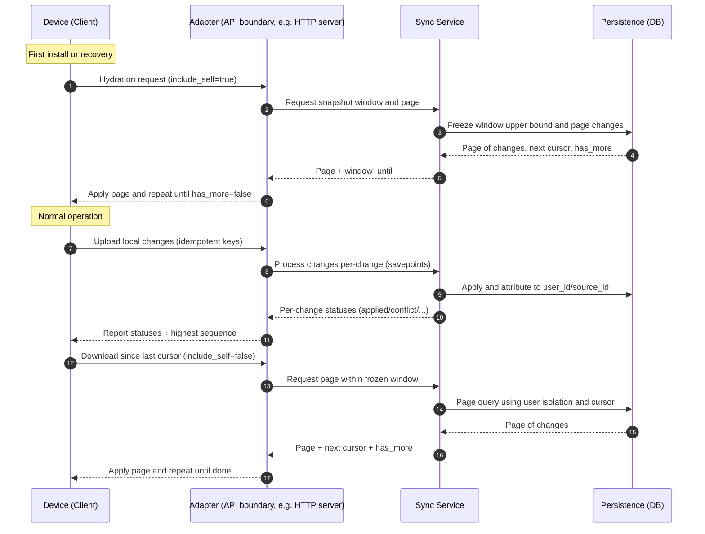

This page explains multi‑device synchronization at a conceptual level. It avoids code and SQL and focuses on models, roles, and flows you can apply to any stack.

## The Multi‑Device Synchronization Problem

You want the same data to appear consistently across a user’s devices (phone, laptop, tablet), even
when devices go offline and reconnect at different times.

Challenges to solve:

- Conflicts: two devices may edit the same record while offline
- Ordering: changes must be applied in a consistent order
- Reliability: uploads can be partially applied; retries must be safe (idempotent)
- Performance: large datasets must sync incrementally and predictably

## Key Players in the Sync System

- user_id
    - The person/tenant who owns the data; all sync operations are scoped to a single user
    - Guarantees isolation: one user’s changes never mix with another’s

- source_id
    - A stable, opaque identifier for one installation of your app on one device
    - Lets the system attribute each change to a device; enables excluding a device’s own changes
      from downloads (to avoid echo)
    - We often use `device_id` as the term for this on the client side, the both represent the same
      concept

- source_change_id
    - A per‑device monotonically increasing sequence number (1, 2, 3, …) assigned by the client to
      each local change
    - Combined with source_id, it forms a unique idempotency key: (source_id, source_change_id)

- server_version
    - A monotonically increasing version maintained by the server for each row/object
    - Enables optimistic concurrency: clients submit expected version; server increments on success
      and reports conflicts when expectations do not match

> Terminology note
>
> source_id and device_id refer to the same concept. We use source_id on the service/server side; on
> the client side it’s commonly called device id. It must be a stable, opaque identifier for one app
> installation on one device.

## Deep dive: identity, source_id (aka device_id), and idempotency

- What is source_id?
    - A random, persistent identifier for one device/app instance (typically UUIDv4). Generate on
      first launch and store in durable local storage.
    - Unique per user: two active devices for the same user must not share a source_id.

- Why it matters
    - The idempotency key (user_id, source_id, source_change_id) lets the server accept safe retries
      without duplicating changes.
    - If two devices share a source_id, their changes can collide and be treated as duplicates.

- Lifecycle best practices
    - New install: generate a fresh source_id; initialize source_change_id = 1
    - Reinstall/restore: reuse the old source_id only if no other active device uses it; otherwise,
      create a new one
    - Device replacement: prefer a new source_id; idempotency still holds because the key is per
      device
    - Rotation: if rotated, reset source_change_id to 1; never reuse the same (source_id,
      source_change_id) pair

- Privacy considerations
    - Keep source_id opaque and free of PII; it exists for sync semantics, not tracking

- Self‑exclusion
    - By default, downloads exclude rows produced by the same source_id (include_self=false)
    - Temporarily set include_self=true for bootstrap/hydration or device recovery when a device
      intentionally wants all server changes, including ones it created in the past

## The Big Picture: How the Flow Works

The system supports three core operations:

- Hydration (Bootstrap): initialize or recover a device by downloading a consistent snapshot
- Upload: send the device’s local changes to the server
- Download: fetch new server changes since the device’s last checkpoint

### High‑level flow (end‑to‑end)

### Hydration (client-side concept)

- Goal: bring a fresh or recovered device to an exact, consistent state
- Device requests a frozen window and downloads in pages
- include_self=true so the device receives all history relevant to the user, including records
  originally uploaded by itself (on older devices)
- The device applies each page atomically and advances its local cursor after each successful page

### Upload (Idempotent, Per‑change)

- Each local change is identified by (source_id, source_change_id) for safe retry
- The server processes each change in isolation (savepoint per change) to allow partial success
- Server returns a per‑change status:
    - applied: accepted and version advanced
    - conflict: version expectation failed; client must pull latest and re‑apply
    - invalid: bad payload or validation failure
    - materialize_error: accepted into sync state but failed secondary materialization (recorded for
      admin retry)

### Download (Windowed and Paged)

- Device requests changes after its last known cursor
- Server freezes an upper bound (window_until) to avoid a moving target while paging
- By default, exclude own device’s changes (include_self=false) to prevent echo
- Device applies each page atomically, then advances its cursor; repeat until has_more=false

### Materialization

Materialization is the process of converting sync data into your application's business tables. When changes are uploaded to the server, they go through two phases:

1. **Sync Storage**: Changes are first stored in the sync metadata tables (sidecar schema) where they're versioned, validated, and prepared for distribution to other devices.

2. **Business Materialization**: Optionally, changes can be materialized into your application's business tables on the server side. This allows:
   - **Server-side queries**: Your backend can query business data directly without parsing sync metadata
   - **Reporting and analytics**: Business intelligence tools can access clean, structured data
   - **API endpoints**: REST APIs can serve data from materialized tables
   - **Integrations**: Other systems can consume data in familiar table formats

**Key Points:**
- Materialization is **optional** - sync works perfectly without it
- If materialization fails, the change is still accepted into sync storage and distributed to devices
- Failed materializations are logged for admin review and retry
- The sync system remains the source of truth; materialized tables are derived views

This separation ensures that sync reliability is never compromised by business logic complexity.

## Summary

- Identity and attribution (user_id, source_id) power isolation and echo‑avoidance
- Idempotency (source_id, source_change_id) makes retries safe and predictable
- Optimistic concurrency via server_version detects conflicts early
- Hydration uses a frozen window to establish a clean baseline; regular sync uses smaller uploads
  and paged downloads to stay up‑to‑date
