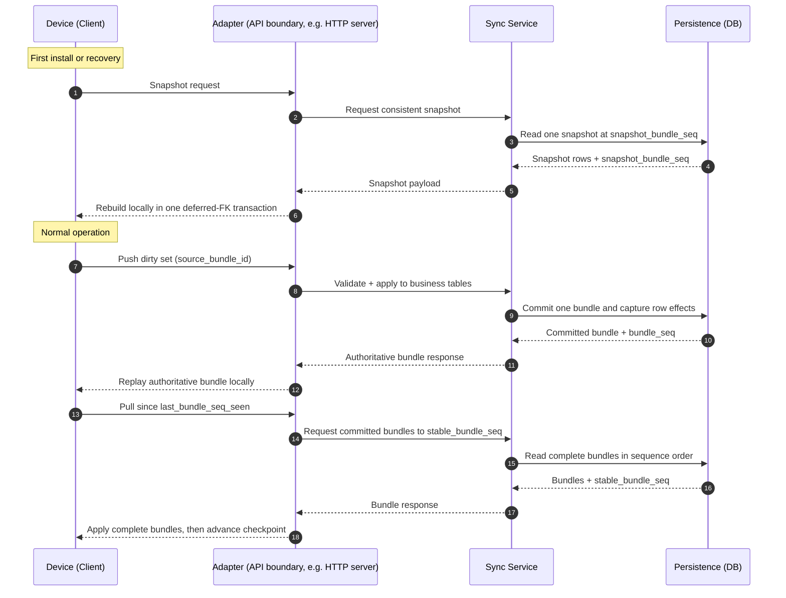

This page explains multi‑device synchronization at a conceptual level. It avoids code and SQL and focuses on models, roles, and flows you can apply to any stack.

## The Multi‑Device Synchronization Problem

You want the same data to appear consistently across a user’s devices (phone, laptop, tablet), even
when devices go offline and reconnect at different times.

Challenges to solve:

- Conflicts: two devices may edit the same record while offline
- Ordering: changes must be applied in a consistent order
- Reliability: retries must be safe (idempotent) and visible state must advance only at durable boundaries
- Performance: large datasets must sync incrementally and predictably

## Key Players in the Sync System

- user_id
    - The person/tenant who owns the data; all sync operations are scoped to a single user
    - Guarantees isolation: one user’s changes never mix with another’s

- source_id
    - A stable, opaque identifier for one local sync runtime
    - Lets the system attribute each pushed bundle to one source stream

- source_bundle_id
    - A per-device monotonically increasing sequence number assigned by the client to each logical
      push bundle
    - Combined with source_id, it forms the idempotency key: (source_id, source_bundle_id)

- bundle_seq
    - A monotonically increasing server sequence for committed bundles
    - Clients pull complete bundles in bundle_seq order and advance durable checkpoints only after
      local apply commits

- row_version
    - A monotonically increasing version maintained by the server per logical row
    - Enables optimistic concurrency during push

## Deep dive: identity, source_id, and idempotency

- What is source_id?
    - A random, persistent identifier for one app runtime (typically UUIDv4). Generate on
      first launch and store in durable local storage.
    - Unique per user: two active sources for the same user must not share a source_id.

- Why it matters
    - The idempotency key (user_id, source_id, source_bundle_id) lets the server accept safe retries
      without duplicating committed bundles.
    - If two sources share a source_id, their changes can collide and be treated as duplicates.

- Lifecycle best practices
    - New install: generate a fresh source_id; initialize source_bundle_id = 1
    - Reinstall/restore: prefer a fresh source_id unless you can prove the old one is still safe to
      reuse
    - Device replacement or same-install recovery: prefer a new source_id when the old writer
      stream is no longer safe to continue
    - Destructive reset-and-rebuild recovery: rotate to a fresh source_id and reset
      source_bundle_id = 1 before new local writes resume
    - Rotation: if rotated, reset source_bundle_id to 1; never reuse the same (source_id,
      source_bundle_id) pair

- Privacy considerations
    - Keep source_id opaque and free of PII; it exists for sync semantics, not tracking

## The Big Picture: How the Flow Works

The system supports three core operations:

- Hydration: initialize a device from one consistent server snapshot
- Push: submit the device’s current local dirty set as one logical bundle
- Pull: fetch committed server bundles since the device’s last durable checkpoint

### High‑level flow (end‑to‑end)

```mermaid
sequenceDiagram
  autonumber
  participant D as Device (Client)
  participant A as Adapter (API boundary, e.g. HTTP server)
  participant S as Sync Service
  participant P as Persistence (DB)

  Note over D: First install or recovery
  D->>A: Snapshot request
  A->>S: Request consistent snapshot
  S->>P: Read one snapshot at snapshot_bundle_seq
  P-->>S: Snapshot rows + snapshot_bundle_seq
  S-->>A: Snapshot payload
  A-->>D: Rebuild locally in one deferred-FK transaction

  Note over D: Normal operation
  D->>A: Push dirty set (source_bundle_id)
  A->>S: Validate + apply to business tables
  S->>P: Commit one bundle and capture row effects
  P-->>S: Committed bundle + bundle_seq
  S-->>A: Authoritative bundle response
  A-->>D: Replay authoritative bundle locally

  D->>A: Pull since last_bundle_seq_seen
  A->>S: Request committed bundles to stable_bundle_seq
  S->>P: Read complete bundles in sequence order
  P-->>S: Bundles + stable_bundle_seq
  S-->>A: Bundle response
  A-->>D: Apply complete bundles, then advance checkpoint
```

### Hydration

- Goal: bring a fresh or recovered device to an exact, consistent state
- Device requests one snapshot that corresponds to exactly one `snapshot_bundle_seq`
- The client rebuilds local managed tables from that snapshot in one deferred-FK transaction
- On success, the local checkpoint becomes the snapshot bundle sequence

### Push

- Each logical push is identified by `(source_id, source_bundle_id)` for safe retry
- The client submits its full current dirty set as one logical bundle
- The server either rejects the entire push or commits one bundle
- On success, the server returns the authoritative committed bundle derived from the actual
  business-table transaction

### Structured push conflicts

- A push conflict is not just a string error; it includes machine-readable conflict details for the
  first rejected row
- The conflict payload describes schema, table, key, local op, base row version, server row
  version, deleted state, and current authoritative row payload when one exists
- Clients can resolve that conflict with one of three explicit outcomes:
  - accept server state
  - keep the latest local intent
  - keep an explicit merged full-row payload
- Valid conflict resolutions are applied locally, surviving intents are requeued, and the client
  retries from a fresh outbound snapshot
- Invalid resolutions and retry exhaustion fail closed while preserving replayable local intent

### Timestamp fields in synced rows

- For application timestamps such as `created_at` and `updated_at`, use SQLite `TEXT` columns with
  UTC RFC3339 or RFC3339Nano values
- Merge policies should parse those timestamps as time values rather than rely on informal string
  conventions
- Older ad hoc formats such as `yyyy:mm:dd hh:mm:ss` are not part of the recommended sync contract

### Pull

- Device requests committed bundles after `last_bundle_seq_seen`
- Server freezes `stable_bundle_seq` for the pull
- The response contains complete bundles only; clients never commit partial bundle visibility
- The client applies bundles in order and advances its checkpoint only after durable local apply
- `last_bundle_seq_seen` means the highest contiguous durably applied bundle, not merely the highest
  seen sequence

### Server Truth

- Business tables are authoritative on the server
- Sync metadata is derived from committed business-table effects
- Server-side cascades and trigger-driven writes are captured into bundles naturally because they are
  part of the committed database transaction
- There is no projection backlog in the core sync path

## Summary

- Identity and attribution (`user_id`, `source_id`) power isolation and idempotency
- Push retries are safe because `(source_id, source_bundle_id)` identifies one logical bundle
- Structured push conflicts are resolved from typed conflict data rather than human-readable errors
- Business tables are authoritative; bundles are derived replication history
- Hydration rebuilds from one consistent snapshot; pull applies complete committed bundles only
